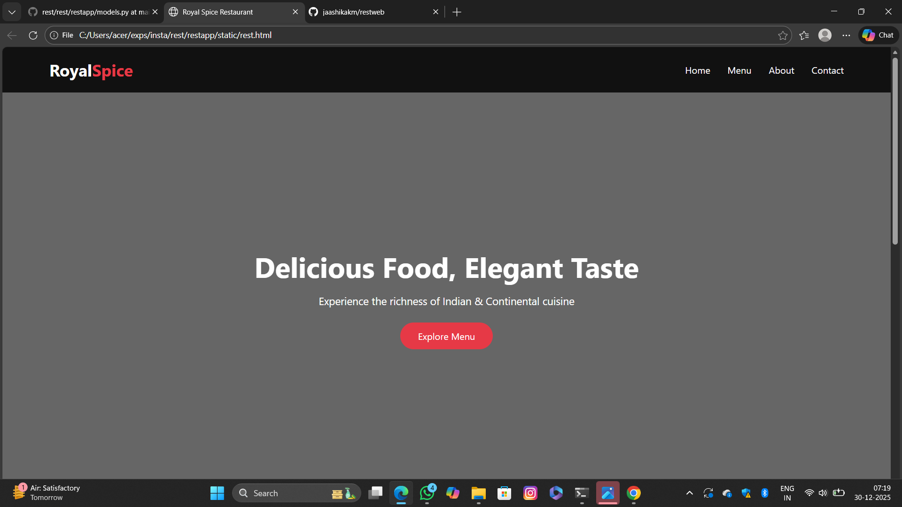

# Ex.06 Restaurant Website
## Date:

## AIM:
To develop a static Restaurant website to display the food items and services provided by them.

## DESIGN STEPS:

### Step 1:
Requirement collection.

### Step 2:
Creating the layout using HTML and CSS.

### Step 3:
Updating the sample content.

### Step 4:
Choose the appropriate style and color scheme.

### Step 5:
Validate the layout in various browsers.

### Step 6:
Validate the HTML code.

### Step 7:
Publish the website in the given URL.

## PROGRAM:
```
rest.html
<!DOCTYPE html>
<html lang="en">
<head>
    <meta charset="UTF-8">
    <title>Royal Spice Restaurant</title>
    <link rel="stylesheet" href="style.css">
</head>
<body>

    <!-- Navbar -->
    <header>
        <h1 class="logo">Royal<span>Spice</span></h1>
        <nav>
            <a href="#home">Home</a>
            <a href="#menu">Menu</a>
            <a href="#about">About</a>
            <a href="#contact">Contact</a>
        </nav>
    </header>

    <!-- Hero Section -->
    <section class="hero" id="home">
        <div class="hero-text">
            <h2>Delicious Food, Elegant Taste</h2>
            <p>Experience the richness of Indian & Continental cuisine</p>
            <button>Explore Menu</button>
        </div>
    </section>

    <!-- Menu Section -->
    <section class="menu" id="menu">
        <h2>Our Special Menu</h2>

        <div class="menu-cards">
            <div class="card">
                
                <h3>Paneer Butter Masala</h3>
                <p>Rich creamy tomato gravy</p>
                <span>₹220</span>
            </div>

            <div class="card">
                
                <h3>Veg Biryani</h3>
                <p>Fragrant basmati rice</p>
                <span>₹180</span>
            </div>

            <div class="card">
                
                <h3>Chocolate Dessert</h3>
                <p>Soft & rich chocolate delight</p>
                <span>₹150</span>
            </div>
            <div class="card">
                
                <h3>Chicken Biryani</h3>
                <p>Fragrant basmati rice with chicken</p>
                <span>₹200</span>
            </div>
            <div class="card">
                
                <h3>Parotta</h3>
                <p>Flaky layered flatbread</p>
                <span>₹120</span>
            </div>
            <div class="card">
                
                <h3>Fried Fish</h3>
                <p>Crispy golden fried fish</p>
                <span>₹250</span>
            </div>


        </div>
    </section>

    <!-- About Section -->
    <section class="about" id="about">
        <h2>About Us</h2>
        <p>
            Royal Spice Restaurant brings you a royal dining experience with
            handpicked ingredients, expert chefs, and an elegant ambience.
        </p>
    </section>

    <!-- Contact -->
    <section class="contact" id="contact">
        <h2>Contact Us</h2>
        <p>📍 Kanchipuram, Tamil Nadu</p>
        <p>📞 +91 98765 43210</p>
        <p>✉️ royalspice@gmail.com</p>
    </section>

    <!-- Footer -->
    <footer>
        <p>© 2025 Royal Spice Restaurant | All Rights Reserved</p>
    </footer>

</body>
</html>

style.css
* {
    margin: 0;
    padding: 0;
    box-sizing: border-box;
    font-family: 'Segoe UI', sans-serif;
}

/* Navbar */
header {
    display: flex;
    justify-content: space-between;
    align-items: center;
    padding: 20px 80px;
    background: #111;
}

.logo {
    color: #fff;
    font-size: 28px;
}

.logo span {
    color: #e63946;
}

nav a {
    color: #fff;
    margin-left: 25px;
    text-decoration: none;
    font-size: 16px;
}

nav a:hover {
    color: #e63946;
}

/* Hero */
.hero {
    height: 90vh;
    background: linear-gradient(rgba(0,0,0,0.6), rgba(0,0,0,0.6)),
                url("images/hero.jpg") center/cover no-repeat;
    display: flex;
    align-items: center;
    justify-content: center;
}

.hero-text {
    color: white;
    text-align: center;
}

.hero-text h2 {
    font-size: 48px;
    margin-bottom: 15px;
}

.hero-text p {
    font-size: 18px;
    margin-bottom: 25px;
}

.hero-text button {
    padding: 12px 30px;
    border: none;
    background: #e63946;
    color: white;
    font-size: 16px;
    cursor: pointer;
    border-radius: 25px;
}

/* Menu */
.menu {
    padding: 70px 80px;
    background: #f8f8f8;
    text-align: center;
}

.menu h2 {
    font-size: 36px;
    margin-bottom: 40px;
}

.menu-cards {
    display: flex;
    justify-content: center;
    gap: 30px;
}

.card {
    background: white;
    width: 280px;
    border-radius: 15px;
    overflow: hidden;
    box-shadow: 0 10px 20px rgba(0,0,0,0.1);
}

.card img {
    width: 100%;
    height: 180px;
    object-fit: cover;
}

.card h3 {
    margin: 15px 0 5px;
}

.card p {
    color: #666;
}

.card span {
    display: block;
    margin: 10px 0 20px;
    font-weight: bold;
    color: #e63946;
}

/* About */
.about {
    padding: 60px 80px;
    text-align: center;
}

.about h2 {
    font-size: 32px;
    margin-bottom: 15px;
}

.about p {
    max-width: 700px;
    margin: auto;
    color: #555;
    font-size: 17px;
}

/* Contact */
.contact {
    background: #111;
    color: white;
    padding: 50px;
    text-align: center;
}

.contact h2 {
    margin-bottom: 15px;
}

/* Footer */
footer {
    background: #000;
    color: #aaa;
    text-align: center;
    padding: 15px;
}
```

## OUTPUT:


## RESULT:
The program for designing software company website using HTML and CSS is completed successfully.
